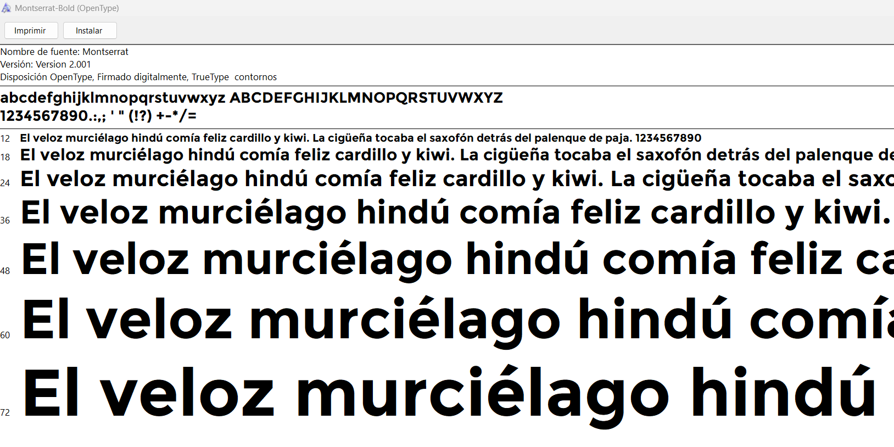

# WADU

# Página web

https://soyadnane.github.io/wadu/

## Descripción del Proyecto

El proyecto consiste en el diseño de una página web para una academia virtual la cual ofrece variados cursos relacionados con la informática, desde programación hasta administración de sistemas, todos estos impartidos por una serie de docentes con una gran experiencia a sus espaldas.

## Funcionalidad de cada página

1. **Inicio:**
   - En esta página se suben todas las novedades que van apareciendo como ofertas de tiempo limitado. (Darle a "ver ahora" y se mostrara la rebaja).

2. **Biblioteca:**
   - En esta página se ubican todos los cursos que ofrece la academia junto a una breve descripción. (Darle a "ver ahora" y se mostrara el precio sin rebaja).

3. **Propuestas:**
   - En esta página los alumnos pueden realizar propuestas mediante un pequeño formulario.

4. **Empleo**
   - En esta página cualquier persona que quiera trabajar con nosotros puede mandarnos su carta de presentación y CV.

5. **La Empresa**
   - Aquí se encuentran un conjunto de páginas sobre la empresa, como el contacto, los docentes, el organigrama, clientes, etc.

6. **Login**
   - En esta página los alumnos pueden iniciar sesión.

7. **Portal Interno**
   - En esta página los nuevos usuarios pueden registrarse en la academia.

INFO: Recalcar que en contacto si se pulsa el botón de "info@wadu" le sacara una ventana para introducir sus datos y contactar con las diferentes sedes.
## Guia de estilos
1. **Fuentes:**
Hemos utilizado dos fuente. Una para los titulos y otra para el texto.
- Fuente para titulos:

- Fuente para texto:

2. **Colores:**
Los colores juegan un papel fundamental en el diseño de una página web, ya que pueden transmitir emociones, establecer la identidad de la marca y afectar la experiencia del usuario. Aquí tienes una pequeña descripción de por qué se han elegido los colores "36AOFF", "01BB92", y "ECECEC" en su página web:

"36AOFF" (Azúl): El azul es un color que generalmente se asocia con la confianza, la seguridad y la profesionalidad. El tono brillante de azul que han elegido puede transmitir una sensación de frescura y modernidad. Además, el azul se relaciona con el cielo y el mar, lo que puede inspirar tranquilidad y confianza en los usuarios.

"01BB92" (Verde Claro): El verde a menudo se suele utilizar como notificación, frescura y algo nuevo, es por ello que lo hemos utilizado para notificar a los usuarios de las últimas noticias de la academia.

"ECECEC" (Gris): El gris es un color que a menuda se asocia al metal y a la tecnología, y por ello hemos decidido que no hay mejor color para usar en una academia virtual dedicada a la informática.

Imagen de los colores respectivamente:

Hemos elegido estos colores porque son los que más relacionamos con la tecnología y el aprendizaje. 

## Esquema de las páginas web
- Inicio: En la página de inicio, se presenta un carrusel que exhibe las imágenes principales de nuestra web, con una transición automática cada 5 segundos. También se proporciona la opción de iniciar sesión o registrarse, en caso de no estar registrado. Más abajo, se pueden visualizar las últimas novedades que hemos incorporado a nuestra página, como nuevos cursos agregados u ofertas.

- Biblioteca: En la sección de la biblioteca, se muestran los cursos disponibles para realizar, junto con toda la información relevante sobre cada curso, acompañada de una pequeña imagen ilustrativa.

- Propuestas: La página de propuestas almacena las solicitudes de aquellos que desean proponer o añadir un curso a nuestra academia. Para ello, se solicitan ciertos datos para facilitar el posterior contacto.

- Empleo: En esta sección, puedes solicitar empleo en la academia para poder trabajar como docente en esta misma. Para ello, se solicitan el CV y una carta de presentación.

- La Empresa: Esta sección reúne varias páginas, donde podemos encontrar a los docentes, el origen de la empresa, la Misión-Visión-Valores de la empresa, el organigrama, los clientes y por último el contacto.

- Login: Inicia Sesión en caso de tener cuenta que se le dará un acceso personalizado a cada usuario. (Alumnado)

- Portal Interno: Se podrán registrar solo las personas autorizadas, para entrar al portal interno. (Profesorado y Trabajadores)

## Tecnologías Utilizadas

- **Lenguajes:** HTML, CSS, JQuery y BootStrap

## Contribución

Si deseas contribuir a este proyecto, ¡estamos abiertos a colaboraciones!
- **Envía un correo:** contact@wadu.com

## Autores
- [@haghmir](https://www.github.com/haghmir)
- [@soyadnane](https://www.github.com/soyadnane)
- [@inigoancin](https://github.com/inigoancin)
- [@davidcarmonaher](https://github.com/davidcarmonaher)